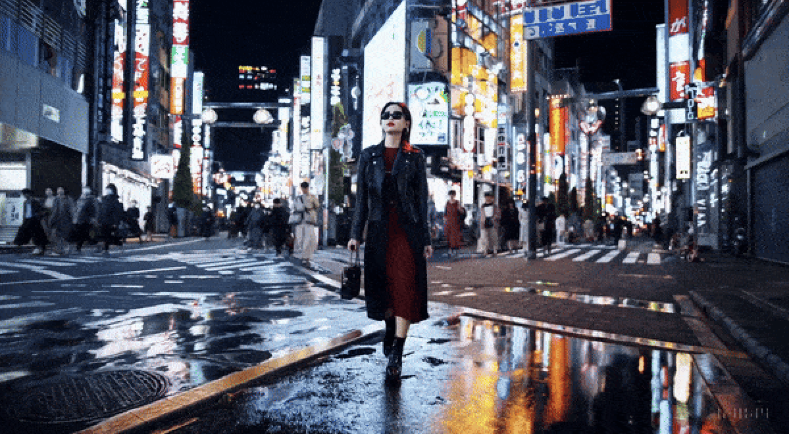
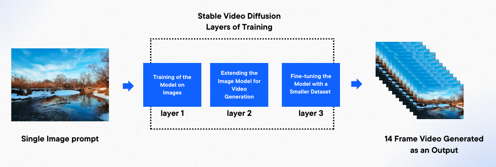
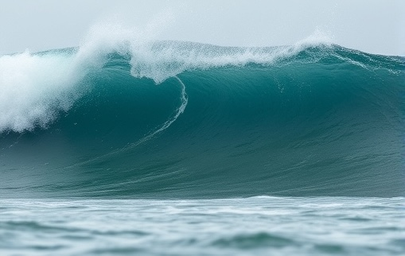
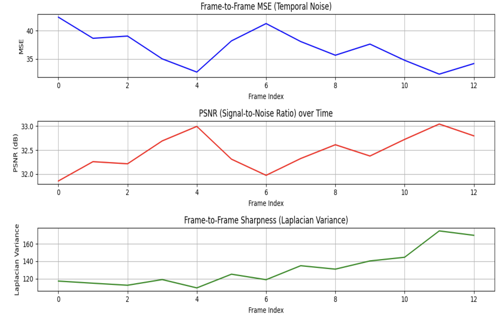

# **Unsupervised Video Generation from Static Images**
🔹 **Generating realistic videos from static images using stable video diffusion models.**  

<p align="center">
  <span style="float: left;"><b>Image Input = </b></span>
  <span style="float: right;"><b>Video Output</b></span>
  <br><br>
  
  
</p>


---

## 📝 **Overview**
This project explores **unsupervised video generation** from static images using **Stable Video Diffusion (SVD)** models. The model evaluates **temporal consistency, sharpness, brightness, noise levels**, and **overall video quality**.  

📌 **Key Contributions:**  
✅ **Stable video diffusion** for high-quality video synthesis  
✅ **Comparison of Colab (GPU) & OpenVINO (CPU) performance**  
✅ **Temporal consistency and sharpness evaluation**  
✅ **Optimization techniques for resource-efficient deployment**  

---

## 🔍 **Motivation**
Generating **realistic video from a single image** has applications in:
- 🎮 **Gaming & Animation** (AI-generated cinematic sequences)  
- 🏥 **Medical Imaging** (3D reconstruction from 2D images)  
- 🎥 **Content Creation & Simulation** (Synthetic video generation)  
- 🕶 **Augmented & Virtual Reality (AR/VR)**  

However, deploying such models across **GPU-heavy** and **CPU-limited platforms** is a challenge. This study aims to **evaluate performance trade-offs** for **high-quality and resource-efficient video generation**.

---

## **🛠️ Methodology**
This project employs **Stable Video Diffusion (SVD)** for **image-to-video generation**, leveraging **deep learning architectures** to create **coherent motion across frames**.

### **📌 System Architecture**
<p align="center">
  
</p>

### **1️⃣ Image Encoder**
- Extracts **spatial features** from the static image.  
- Converts the input into a **latent representation**.

### **2️⃣ Motion Module**
- Generates **motion trajectories** between frames.  
- Ensures **smooth transitions** for temporal consistency.

### **3️⃣ Frame Generation Pipeline**
- Uses a **denoising process** to refine intermediate frames.  
- **Reconstructs pixel-level video frames** while ensuring fidelity.  

### **4️⃣ GPU vs CPU Optimization**
- **Colab (GPU)**: Uses **CUDA acceleration** for fast generation.  
- **OpenVINO (CPU)**: Uses **model quantization & operation fusion** for efficiency.  

---

## **📊 Experiments & Results**
This study compares **Colab (GPU)** and **OpenVINO (CPU)** in terms of **performance and video quality**.

### 📌 **Quantitative Metrics**
| **Metric**                     | **Colab (GPU-Based)** | **OpenVINO (CPU-Based)** |
|--------------------------------|----------------------|----------------------|
| **Temporal Consistency (MSE)** | **36.90 (Lower is better)** | **55.33** |
| **Sharpness (Laplacian Variance)** | **130.91** | **605.91** |
| **Brightness (Mean Pixel Intensity)** | **124.69** | **120** |

### 📌 **Qualitative Results**
### **1️⃣ Colab Generated Input and Onput**
<p align="center">
  <span style="float: left;"><b>Image Input = </b></span>
  <span style="float: right;"><b>Video Output</b></span>
  <br><br>
  
  
</p>

### **2️⃣ OpenVIVO Generated Input and Output**
<p align="center">
  <span style="float: left;"><b>Image Input = </b></span>
  <span style="float: right;"><b>Video Output</b></span>
  <br><br>
  
  
</p>

✅ **Colab-generated videos** have **better temporal smoothness** due to GPU acceleration. 

<p align="center">
  
</p>

✅ **OpenVINO videos** are **resource-efficient**, making them suitable for **low-power devices**.  

<p align="center">
  
</p>

---

## 📥 **Installation & Usage**  

### **🔧 Setup Instructions**
To run the model, follow these steps:

### 1️⃣ **Clone the Repository**
```bash
git clone https://github.com/JamunaSMurthy/Unsupervised-Video-Generation.git
```
2️⃣ Navigate to the Project Directory
cd Unsupervised-Video-Generation
3️⃣ Install the Required Dependencies
pip install -r requirements.txt
4️⃣ Run the Video Generation Pipeline

```bash
python generate_video.py --input image.jpg --output video.mp4
```
Arguments:

--input : Path to static image.
--output : Path to generated video.
⚙️ Implementation Details

- 📌 Colab Implementation (GPU)
Uses PyTorch for stable video diffusion.
Optimized using batch processing & CUDA acceleration.
- 📌 OpenVINO Implementation (CPU)
Uses Intel OpenVINO Runtime for inference.
Quantization & operation fusion reduce memory usage.
- 📌 Key Libraries Used:

```bash
torch==2.0.1
diffusers==0.24.0
transformers==4.35.2
opencv-python==4.8.0
openvino==2023.1.0
```
# 🔬 Ablation Studies

We tested the impact of various optimizations on performance:

- ✅ Effect of Quantization (OpenVINO)

Without quantization: Sharper videos but slower inference.
With quantization: Faster inference with minor quality trade-offs.

- ✅ Temporal Layer Impact

Without temporal layers: Higher MSE & lower coherence.
With temporal layers: Improved smoothness & consistency.

- ✅ Noise Schedule Adjustments

Tuned schedules improved PSNR & reduced artifacts.

---
## 🔮 Future Enhancements

🚀 Planned Improvements:

- ✔️ Real-time video generation with adaptive frame rates.
- ✔️ Hybrid GPU-CPU deployment for scalable solutions.
- ✔️ Enhancing model robustness on diverse datasets.

## 📜 Citation & References

If you use this work, please cite this repository:
```bash
@misc{JamunaSMurthy2025,
  author = {Jamuna S Murthy},
  title = {Unsupervised Video Generation from Static Images},
  year = {2025},
  howpublished = {\url{https://github.com/JamunaSMurthy/Unsupervised-Video-Generation/}},
  note = {GitHub repository}
}
```
## 📖 Related Works:
Stable Video Diffusion Model – HuggingFace
OpenVINO Model Optimization – OpenVINO Repo
MoCoGAN: Motion and Content for Video Generation – CVPR Paper

---

## 👨‍💻 Contributors

@JamunaSMurthy
- 🚀 Feel free to contribute to this repository by submitting issues or pull requests!

⭐ Support & Feedback

- If you find this project useful, please ⭐ star this repository and share your feedback!


